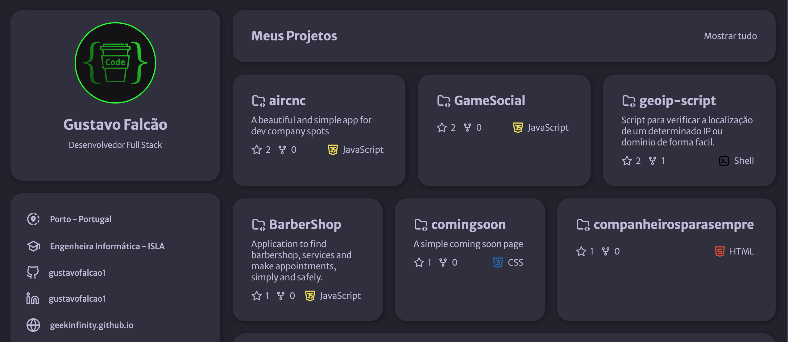

# 📄 Digital Resume

An interactive and structured digital resume created with **ReactJS**, providing an engaging way to present my GitHub profile and professional experience clearly and elegantly.

🌐 **[Live Demo](https://gustavofalcao1.github.io/digitalresume/)**

---

## ✨ Features

- 📌 **Clean and professional layout**
- 📌 **Dynamic content integration with GitHub**
- 📌 **Interactive and responsive design**

---

## 🛠️ Technologies

- **ReactJS**
- **JavaScript**
- **Axios** (for API requests)
- **CSS** (for styling)
- **Yarn** (package management)
- **NodeJS** (development environment)

---

## 🚀 Quick Start

Clone and install dependencies:

```bash
git clone https://github.com/gustavofalcao1/digitalresume.git
cd digitalresume
yarn install
```

Run the development server:

```bash
yarn start
```

Visit the application at [http://localhost:3000](http://localhost:3000)

---

## 📸 Screenshot

<div align="center">
  
</div>

---

## 🤝 Contributing

Your contributions and feedback are appreciated:

1. Fork the repository
2. Create a feature branch (`git checkout -b feature/feature-name`)
3. Commit changes (`git commit -m 'Add feature-name'`)
4. Push the branch (`git push origin feature/feature-name`)
5. Submit a Pull Request

---

## 📄 License

Licensed under the **MIT License**.

---

## 👤 Author

**Gustavo Falcão**  
[GitHub @gustavofalcao1](https://github.com/gustavofalcao1)  
[Project Repository](https://github.com/gustavofalcao1/digitalresume)

---
